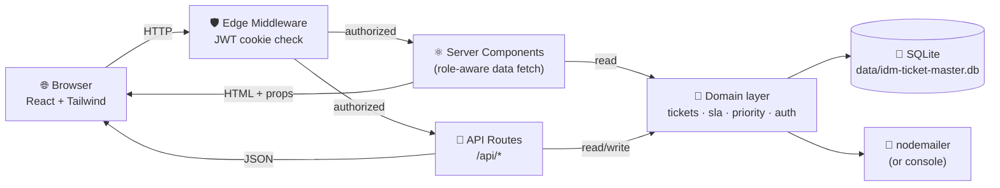
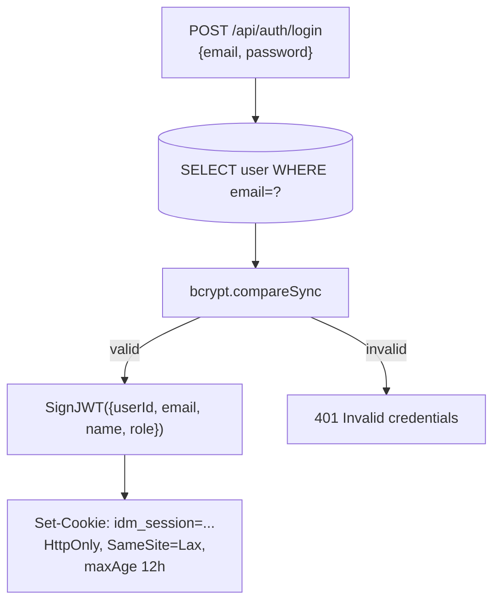
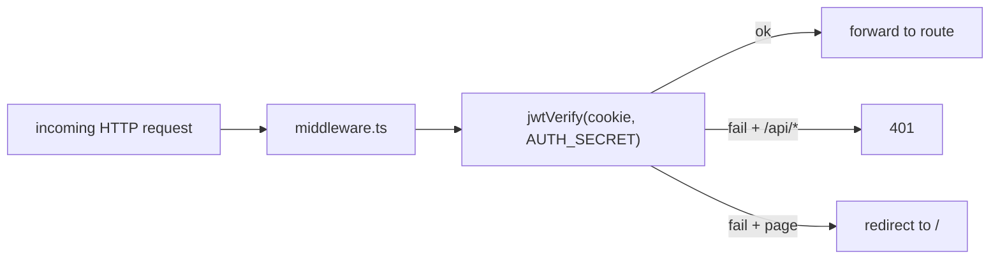
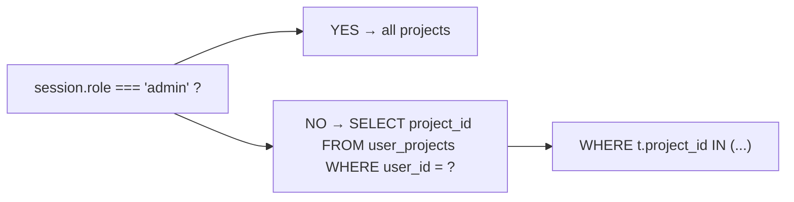
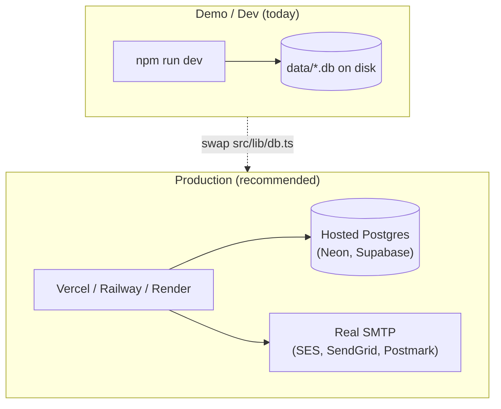

# Architecture guide

A walkthrough of *how* IDM Ticket Master is put together: the stack choices, the layers, where each concern lives, and how a request flows from the browser to the database and back.

> If you're a developer joining this project, read this in order. If you only want to *use* the app, see [`SETUP.md`](../SETUP.md).

---

## 1. The big picture



**One process, three jobs:** Next.js serves the HTML *and* the API *and* runs the business logic — there's no separate backend server. The "frontend" and "backend" share the same TypeScript types, the same `db()` connection helper, and the same business rules (`sla.ts`, `priority.ts`, `tickets.ts`).

---

## 2. Tech stack and the rationale for each choice

| Layer | Choice | Why this and not something else |
|---|---|---|
| Runtime | **Node.js 20+** | Required by Next.js 14. Node 20+ ships **`node:sqlite` built-in**, removing the need for `better-sqlite3` (which would need Visual Studio C++ to compile on Windows). |
| Framework | **Next.js 14, App Router** | Server Components let role-gated pages fetch their *own* data — no client→API round trip on every page load. One deployable artifact. |
| Language | **TypeScript (strict + noUncheckedIndexedAccess)** | Catches the "I forgot to handle null" and "wrong field name" bugs that ticketing apps die from. |
| Styling | **Tailwind CSS** + custom shadcn-style components | No design-system overhead, full control over the Accenture purple palette, fast iteration. |
| Database | **SQLite via `node:sqlite`** | Zero install. One file. Perfect for a presentation/demo. Swap to Postgres by replacing one file (`src/lib/db.ts`). |
| Auth | **Signed JWT cookies (`jose`)** + bcrypt password hash | Stateless, no Redis, no session table. Edge-runtime compatible (middleware can verify). |
| Validation | Manual in API routes | No Zod yet — the surface is small. Could be added later. |
| Email | **Nodemailer**, console fallback when SMTP unset | Lets the dev see notification flow with zero external setup. |
| Tables / state | Custom React + `useState` | TanStack Table / React Query are overkill for this scope. |
| Date/time | **`date-fns`** | Tiny, treeshakeable, no globals (vs. moment.js). |
| Icons | **`lucide-react`** | One icon set, ~3KB per icon imported. |

---

## 3. The five layers

The codebase has **five clearly-separated layers**. The arrows show the only legal direction of dependency — never the reverse.

```
Browser
   ↓
Middleware  (src/middleware.ts)
   ↓
UI layer    (src/app/**/page.tsx, src/components/*)
   ↓
API layer   (src/app/api/**/route.ts)        ← Auth/role gate happens here
   ↓
Domain layer (src/lib/tickets.ts, sla.ts, priority.ts, auth.ts, email.ts, ...)
   ↓
Persistence (src/lib/db.ts → node:sqlite)
```

**Why this matters:** if you ever add a feature, ask yourself "what layer does this belong in?" If a UI component knows the SQL of a JOIN, you've broken the contract.

| Layer | Responsibility | Example file |
|---|---|---|
| **Middleware** | Verify JWT cookie. Redirect anonymous users to `/`. Block API calls with 401. | `src/middleware.ts` |
| **UI** | Render React. No SQL, no auth checks beyond reading session for layout decisions. | `src/components/dashboard.tsx` |
| **API** | Parse request, call domain layer, return JSON. Enforce role/field gates here. | `src/app/api/tickets/[id]/route.ts` |
| **Domain** | Business rules — SLA windows, priority derivation, status transitions, audit log | `src/lib/tickets.ts`, `src/lib/sla.ts`, `src/lib/priority.ts` |
| **Persistence** | Open the connection, run the SQL, normalize null-prototype rows. | `src/lib/db.ts` |

---

## 4. Project structure (annotated)

```
Idm-ticket-master/
├── README.md                  # What this app is + design decisions
├── SETUP.md                   # Non-technical setup walkthrough
├── docs/                      # ← You are here
├── package.json               # npm scripts: dev / build / start / typecheck
├── next.config.js             # Tells Next.js to keep node:sqlite as a server-only module
├── tailwind.config.ts         # Accenture purple palette, custom utility classes
├── tsconfig.json              # strict + noUncheckedIndexedAccess
├── .env.example               # Template — copy to .env.local and edit
├── data/                      # SQLite file (gitignored)
└── src/
    ├── middleware.ts          # JWT cookie check on every request
    │
    ├── lib/                   ← The brain
    │   ├── db.ts              # SQLite connection, schema bootstrap, plain-object normalization
    │   ├── auth.ts            # JWT sign/verify, bcrypt, role + project resolution
    │   ├── tickets.ts         # CRUD + status transitions + SLA pause/resume + audit log
    │   ├── sla.ts             # Severity → window, expiry, indicators, auto-expiry rules
    │   ├── priority.ts        # Derived priority logic + badge style helpers
    │   ├── ticket-number.ts   # IDM-YYYYMM-NNNN generator
    │   ├── projects.ts        # Project list (admin) / scoped list (user)
    │   ├── users.ts           # Admin list, user lookup
    │   ├── email.ts           # nodemailer + console fallback
    │   ├── seed.ts            # Idempotent demo data
    │   ├── types.ts           # Shared TS types (Role, Status, Severity, Priority, ...)
    │   └── utils.ts           # cn() — Tailwind class merger
    │
    ├── app/                   ← Routes (App Router)
    │   ├── layout.tsx         # Root HTML, Toaster
    │   ├── globals.css        # Tailwind + .btn / .card / .badge utility classes
    │   ├── page.tsx           # /  → login (redirects to /dashboard if signed in)
    │   │
    │   ├── api/               ← All HTTP endpoints
    │   │   ├── auth/login/route.ts
    │   │   ├── auth/logout/route.ts
    │   │   ├── auth/me/route.ts
    │   │   ├── tickets/route.ts             # GET (list) / POST (create)
    │   │   ├── tickets/[id]/route.ts        # GET / PATCH
    │   │   ├── tickets/[id]/activities/route.ts  # GET / POST
    │   │   ├── projects/route.ts            # Scoped per role
    │   │   └── admins/route.ts              # Admin-only — for assignment dropdown
    │   │
    │   └── dashboard/         ← Authenticated pages
    │       ├── layout.tsx     # Top bar + container
    │       ├── page.tsx       # Tabs + filters + ticket table
    │       └── tickets/
    │           ├── new/page.tsx
    │           └── [id]/page.tsx
    │
    └── components/            ← React components
        ├── topbar.tsx
        ├── login-form.tsx     # Quick-fill demo accounts
        ├── dashboard.tsx      # Tab/filter state, table refresh
        ├── ticket-table.tsx   # Role-aware columns + SLA badges
        ├── ticket-create-form.tsx
        └── ticket-details.tsx # Two-tab Details + Activities, all admin controls
```

---

## 5. The lifecycle of a single request

Let's trace what happens when an admin clicks **"Save"** after changing a ticket's severity.

```mermaid
sequenceDiagram
    autonumber
    participant B as Browser<br/>(ticket-details.tsx)
    participant M as middleware.ts
    participant R as /api/tickets/[id]<br/>route.ts
    participant L as src/lib/tickets.ts<br/>(updateTicket)
    participant SLA as src/lib/sla.ts
    participant P as src/lib/priority.ts
    participant DB as data/idm-ticket-master.db
    participant E as src/lib/email.ts

    B->>M: PATCH /api/tickets/3<br/>cookie: idm_session=...
    M->>M: jwtVerify(cookie)
    alt cookie invalid
        M-->>B: 401 UNAUTHORIZED
    end
    M->>R: forward request
    R->>R: getSession() → role=admin
    R->>L: updateTicket({session, ticketId:3, updates:{severity:'High'}})
    L->>DB: SELECT * FROM tickets WHERE id=3
    DB-->>L: previous row
    L->>SLA: calculateExpiry(ack, severity, pausedMs)
    SLA-->>L: new expiry timestamp
    L->>P: derivePriority(updatedTicket)
    P-->>L: new priority
    L->>DB: UPDATE tickets SET severity='High', priority='High', sla_expires_at=...
    L->>DB: INSERT INTO activities (system, 'Severity changed: Low → High')
    L-->>R: updated TicketRow
    R->>E: sendTicketNotification('severity_changed', ticket)
    E->>E: SMTP_HOST unset → console.log('[email:mock] ...')
    R-->>B: 200 { ticket: {...} }
    B->>B: setTicket(j.ticket); reload activities; toast.success
```

**Things to notice:**
- Auth happens **twice** — once at the edge (middleware) and once inside the route (`getSession()`). The middleware is a fast-fail; the route is the source of truth for role + user ID.
- The domain layer (`updateTicket`) **never trusts the request**. It re-reads the ticket from the DB, applies its own rules (SLA pause/resume, priority derivation, status transition), and writes back. The API layer only translates HTTP ↔ function calls.
- Every state change writes a **system activity** before the response returns. The audit trail is automatic, not opt-in.

---

## 6. Where each business rule lives

| Rule | File | Function |
|---|---|---|
| User vs Admin role gate | `src/lib/auth.ts` | `requireSession`, `requireAdmin` |
| Project-level data privacy | `src/lib/tickets.ts` | `listTicketsForSession`, `getTicketByIdForSession` |
| SLA window per severity | `src/lib/sla.ts` | `slaWindowMs` |
| SLA pause when status = Pending/On-Hold | `src/lib/tickets.ts` | `updateTicket` (look for `wasPaused` / `willBePaused`) |
| SLA recalc on severity change | `src/lib/tickets.ts` | `updateTicket` |
| Priority derivation (production / go-live / severity / SLA proximity) | `src/lib/priority.ts` | `derivePriority` |
| Auto-close after 15 days inactivity | `src/lib/tickets.ts` | `runAutoExpiry` (called on every list/read) |
| Auto-close exemption for production / escalated / high-priority | `src/lib/sla.ts` | `isAutoExpiryAllowed` |
| Ticket number format | `src/lib/ticket-number.ts` | `nextTicketNumber` |
| Audit-trail entries on every change | `src/lib/tickets.ts` | `appendActivity` calls inside `updateTicket` |
| Email recipients | `src/lib/email.ts` | `recipients()` reads env vars |

When a requirement changes, you should be able to find the file in one guess from this table.

---

## 7. Authentication & authorization



**Each subsequent request:**



**Project-level data privacy** is enforced server-side, never client-side:



A non-admin trying to read ticket #3 (a project they're not assigned to) gets a **404** even though the row exists — the row is filtered before the response is built (`getTicketByIdForSession`). They never learn it exists.

---

## 8. Where to add things

| You want to... | Edit |
|---|---|
| Add a new field to tickets | `src/lib/types.ts` (type) → `src/lib/db.ts` (schema) → `src/lib/tickets.ts` (mapRow + create/update) → `src/components/ticket-create-form.tsx` and `ticket-details.tsx` (UI) |
| Add a new role (e.g. "viewer") | `Role` in `types.ts` → all role checks (`auth.ts`, `tickets.ts`, route handlers, `topbar.tsx`) |
| Add a new ticket status | `STATUS_OPTIONS` in `types.ts` → review SLA pause logic in `updateTicket` and `sla.ts` |
| Change SLA windows | `SLA_HOURS_BY_SEVERITY` in `src/lib/sla.ts` |
| Change auto-close window | `AUTO_CLOSE_INACTIVITY_DAYS` in `src/lib/sla.ts` + the cutoff in `runAutoExpiry` |
| Swap SQLite for Postgres | Rewrite **only** `src/lib/db.ts` to use `pg`. Every other file uses the same `prepare/run/get/all` interface. |
| Add a new dashboard column | `src/components/ticket-table.tsx` |
| Add a new email template | `src/lib/email.ts` (extend the `subjectMap` and the body lines) |

---

## 9. Deployment topology

The app is currently run as `npm run dev` on a developer's machine. To run it for real:



**Production checklist:**
1. Replace `src/lib/db.ts` with a Postgres-backed implementation (interface stays the same).
2. Set `AUTH_SECRET` to a 32+ character random string in your hosting platform's env vars.
3. Set `SMTP_HOST` / `SMTP_USER` / `SMTP_PASS` / `EMAIL_*_DISTRIBUTION` for real notifications.
4. Either enable Accenture SSO (replace `authenticate()` with an SSO callback) or keep email/password auth.
5. Add a backup strategy for the database.

See [WORKFLOWS.md](WORKFLOWS.md) for end-to-end user journeys and [DATA_MODEL.md](DATA_MODEL.md) for the schema and entity relationships.
