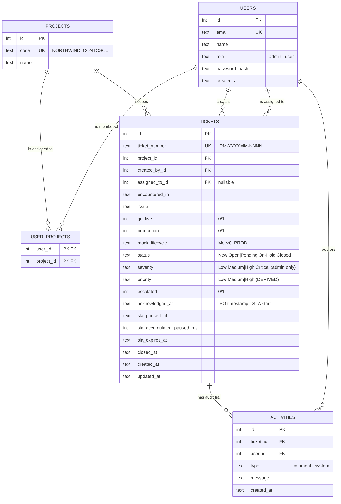
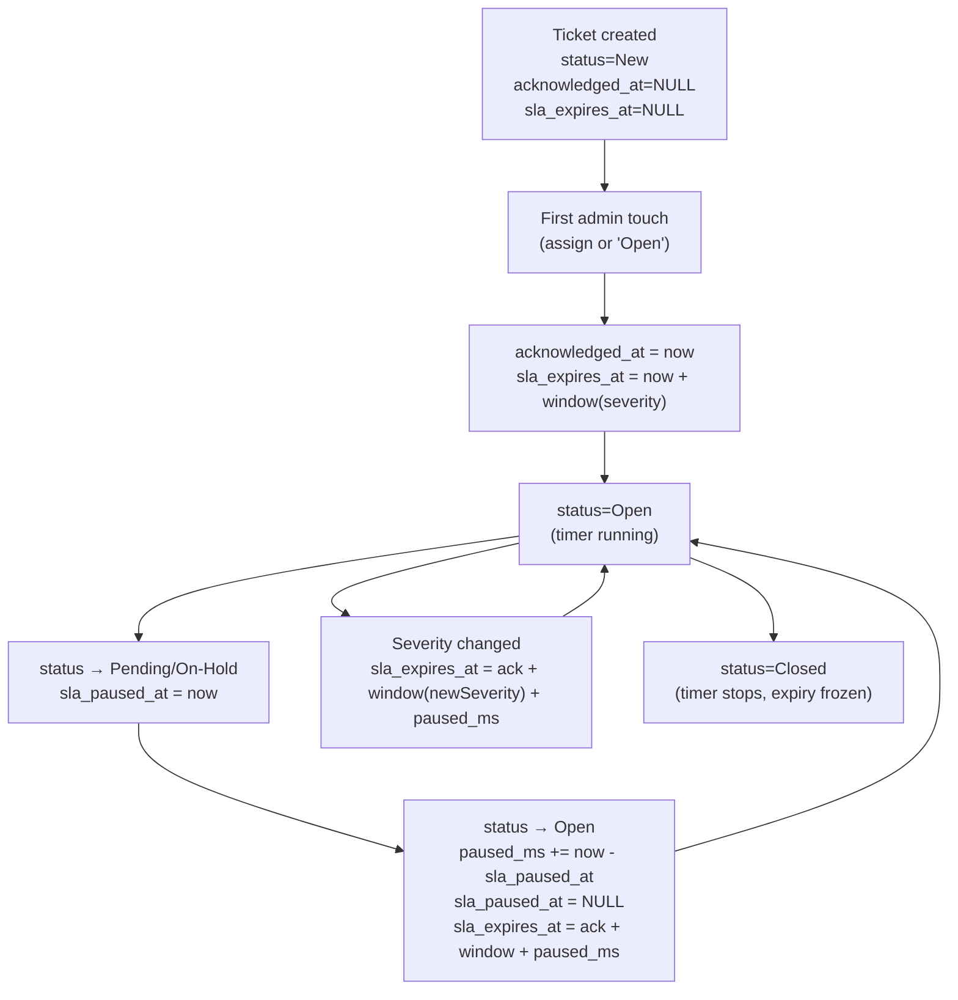
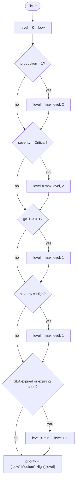

# Data model & relationships

The complete schema, foreign keys, and how every concept (status, severity, priority, SLA) connects to every other concept.

> The schema lives in [`src/lib/db.ts`](../src/lib/db.ts) (`initSchema` function). It auto-creates on first launch.

---

## 1. Entity-relationship diagram



---

## 2. Tables — column-by-column

### `projects`

A project / client / engagement. Everything is scoped by project.

| Column | Type | Notes |
|---|---|---|
| `id` | INTEGER PK | Auto-increment |
| `code` | TEXT UNIQUE | Short code shown on dashboards (e.g. `NORTHWIND`) |
| `name` | TEXT | Full display name (e.g. `Northwind Trading Co.`) |

### `users`

An identity. Role is determined here — there is no UI toggle.

| Column | Type | Notes |
|---|---|---|
| `id` | INTEGER PK | |
| `email` | TEXT UNIQUE | Login identifier |
| `name` | TEXT | Display name |
| `role` | TEXT CHECK | `admin` (IDM Support) or `user` (Conversion Team) |
| `password_hash` | TEXT | bcrypt hash, never the plain password |
| `created_at` | TEXT | ISO timestamp |

### `user_projects` (junction table)

Many-to-many. A user can belong to multiple projects; a project can have many users.

| Column | Type | Notes |
|---|---|---|
| `user_id` | INTEGER PK,FK | → `users.id`, `ON DELETE CASCADE` |
| `project_id` | INTEGER PK,FK | → `projects.id`, `ON DELETE CASCADE` |

> **Admins** are still in this table — but every admin is given access to every project at seed time. Their global view is determined by `role='admin'` (see `listTicketsForSession` in [src/lib/tickets.ts](../src/lib/tickets.ts)), not by membership rows.

### `tickets`

The center of the universe.

| Column | Type | Notes |
|---|---|---|
| `id` | INTEGER PK | |
| `ticket_number` | TEXT UNIQUE | Human-readable: `IDM-YYYYMM-NNNN` |
| `project_id` | INTEGER FK | → `projects.id` |
| `created_by_id` | INTEGER FK | → `users.id` |
| `assigned_to_id` | INTEGER FK | → `users.id`, **nullable** ("unassigned") |
| `encountered_in` | TEXT | User-entered context ("Conversion Run #42") |
| `issue` | TEXT | The description |
| `go_live` | INTEGER | 0 or 1, user-set |
| `production` | INTEGER | 0 or 1, user-set |
| `mock_lifecycle` | TEXT | `Mock0`, `Mock1`, …, `Mock9`, `PRE-SIT`, `SIT`, `UAT`, `RECON`, `PROD`. Nullable. |
| `status` | TEXT | `New \| Open \| Pending \| On-Hold \| Closed` |
| `severity` | TEXT | `Low \| Medium \| High \| Critical`. **Admin-only** edit path. |
| `priority` | TEXT | `Low \| Medium \| High`. **Derived** from other fields, never user-set directly. |
| `escalated` | INTEGER | 0 or 1, admin-only |
| `acknowledged_at` | TEXT | ISO. **Set once** when admin first opens or assigns. SLA starts from here. |
| `sla_paused_at` | TEXT | ISO. Set when status enters Pending/On-Hold; cleared when leaving. |
| `sla_accumulated_paused_ms` | INTEGER | Total milliseconds the SLA has been paused (across all pauses). |
| `sla_expires_at` | TEXT | ISO. `acknowledged_at + slaWindow(severity) + paused_ms`. |
| `closed_at` | TEXT | ISO. Set when status becomes `Closed`; cleared on reopen. |
| `created_at`, `updated_at` | TEXT | ISO timestamps |

**Indexes:** `project_id`, `status`, `assigned_to_id` — the three columns we filter on most often.

### `activities`

The audit trail. Every status change, severity change, assignment change, and human comment lives here in chronological order.

| Column | Type | Notes |
|---|---|---|
| `id` | INTEGER PK | |
| `ticket_id` | INTEGER FK | → `tickets.id`, `ON DELETE CASCADE` |
| `user_id` | INTEGER FK | → `users.id` (the actor) |
| `type` | TEXT CHECK | `comment` (human) or `system` (auto-generated by `updateTicket`) |
| `message` | TEXT | Free-form, e.g. `"Severity changed: Low → High"` |
| `created_at` | TEXT | ISO timestamp |

---

## 3. Status state machine

```mermaid
stateDiagram-v2
    [*] --> New: Ticket created
    New --> Open: Admin acknowledges (assign / first open)
    New --> Closed: Auto — 15 days unacknowledged*
    Open --> Pending: Admin pushes back to requester
    Open --> "On-Hold": Admin waits on third party
    Pending --> Open: Requester responded
    "On-Hold" --> Open: Third party responded
    Open --> Closed: Admin resolves
    Open --> Closed: Auto — 15 days inactive*
    Closed --> [*]

    note right of Pending: SLA paused
    note right of "On-Hold": SLA paused
    note right of Open: SLA running
    note right of New: SLA NOT started yet
```

**\*Auto-close exceptions** (`isAutoExpiryAllowed` in [src/lib/sla.ts](../src/lib/sla.ts)):
- `escalated = 1` → never auto-close
- `production = 1` → never auto-close
- `priority = 'High'` → never auto-close

These tickets stay in their current state forever until an admin acts.

---

## 4. SLA accounting — how the timer works



**Severity → window mapping** (configurable in `src/lib/sla.ts`):

| Severity | Window |
|---|---|
| Low | 2 days |
| Medium | 3 days |
| High | 5 days |
| Critical | 7 days |

> Higher severity = more complex issue = **longer** allowed resolution time (per the requirements: "Severity = technical complexity, not urgency"). Urgency lives in priority.

**SLA risk indicators** (`slaIndicators` in `src/lib/sla.ts`):

| Condition | Indicator | Color |
|---|---|---|
| `now > sla_expires_at` | **Expired** | Red |
| `sla_expires_at - now < 24h` | **Expiring soon** | Amber |
| Otherwise | **On track** | Green |
| `acknowledged_at IS NULL` or `status = Closed` | **Not started** / hidden | Gray |

These columns and indicators are **only visible to admins**.

---

## 5. Priority — how it's derived (never user-set)

Priority is computed every time a ticket is read or updated, by `derivePriority` in [`src/lib/priority.ts`](../src/lib/priority.ts).



**Worked examples:**

| Ticket | Severity | go_live | production | SLA state | Result |
|---|---|---|---|---|---|
| Default new ticket | Low | 0 | 0 | not started | **Low** |
| Production cutover | Low | 1 | 1 | on track | **High** (production wins) |
| Investigation | Critical | 0 | 0 | on track | **High** (severity Critical → 2) |
| Go-live tweak | Medium | 1 | 0 | on track | **Medium** |
| Inactive low-sev | Low | 0 | 0 | expiring soon | **Medium** (bumped from Low by SLA proximity) |
| Forgot to merge | High | 0 | 0 | expired | **High** (Medium from severity, +1 from SLA expired = 2 = High) |

**Why it's derived, not stored editable:** the requirements explicitly say "Priority is derived from production / go-live / severity / SLA proximity" and "[Production / Go-Live] should be treated as higher business priority but **must not overwrite severity**". Storing it as editable would let it drift out of sync with its inputs.

---

## 6. Audit-trail entries (who writes what)

Every entry in `activities` is one of these shapes:

| Trigger | Type | Example message |
|---|---|---|
| Ticket created | `system` | `Ticket created` |
| User posts a comment | `comment` | (free text) |
| Status change | `system` | `Status changed: New → Open` |
| Severity change | `system` | `Severity changed: Low → High` |
| Assignment change | `system` | `Assigned to: Alex Admin` |
| Escalation toggle on | `system` | `Ticket escalated` |
| Escalation toggle off | `system` | `Escalation cleared` |
| Other detail change | `system` | `Ticket details updated` |
| Auto-expiry close | `system` | `Auto-closed after 15 days of inactivity` |

System messages are written by `appendActivity` calls inside `updateTicket`. They cannot be edited or deleted — the audit trail is immutable in practice.

---

## 7. Permission matrix (which role can read/write what)

| Resource | Admin | User (in-project) | User (other project) |
|---|---|---|---|
| List tickets | All projects | Their projects only | Empty |
| Read a ticket | Yes | Yes | **404** (acts like it doesn't exist) |
| Read a ticket's activities | Yes | Yes | **404** |
| Create a ticket | Any project | In their projects only | **403** |
| Update encountered_in / issue / go_live / production / mock_lifecycle | Yes | **Only on their own ticket and only if not Closed** | **403** |
| Update severity | Yes | **Always rejected (403)** | **403** |
| Update status | Yes | **Always rejected (403)** | **403** |
| Update assigned_to_id | Yes | **Always rejected (403)** | **403** |
| Toggle escalated | Yes | **Always rejected (403)** | **403** |
| Post a comment to activities | Yes | Yes (own project) | **403** |
| See SLA expiry / risk indicators | Yes | **Hidden** | Hidden |
| See `Project` column on dashboard | Yes | Yes (only their projects) | n/a |
| List admins (for assignment dropdown) | Yes | **403** | **403** |

These rules are enforced in three places, in order of trust:
1. **Middleware** — only `cookie-valid?` check
2. **API route** — drops admin-only fields from the request body when role !== 'admin'
3. **Domain layer** — re-validates role + project membership against the database before any write

---

## 8. The seed data (for reference)

[`src/lib/seed.ts`](../src/lib/seed.ts) populates this if the `users` table is empty.

**Projects:** `NORTHWIND`, `CONTOSO`, `FABRIKAM`

**Users:**

| Email | Role | Projects |
|---|---|---|
| `admin@idm.com` | admin | All |
| `backup.admin@idm.com` | admin | All |
| `northwind.user@idm.com` | user | Northwind |
| `contoso.user@idm.com` | user | Contoso |
| `multi.user@idm.com` | user | Northwind + Fabrikam |

**Tickets:**

| # | Project | Status | Severity | Notes |
|---|---|---|---|---|
| IDM-YYYYMM-0001 | Northwind | New | Low | Unacknowledged — no SLA |
| IDM-YYYYMM-0002 | Contoso | New | Low | Unacknowledged |
| IDM-YYYYMM-0003 | Fabrikam | Open | High | Production + Go-Live both Yes — derives Priority=High, SLA running |
