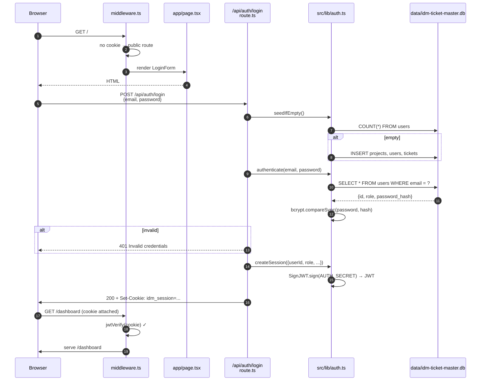
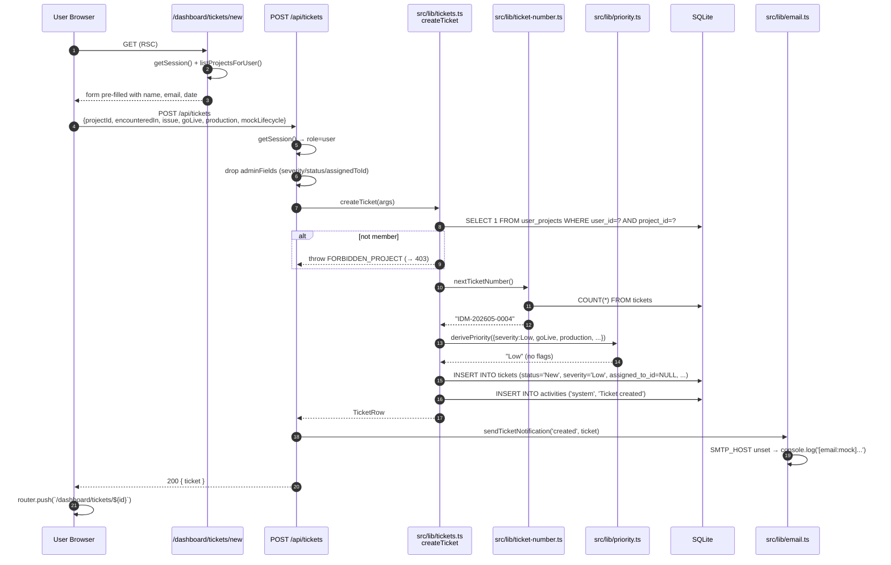
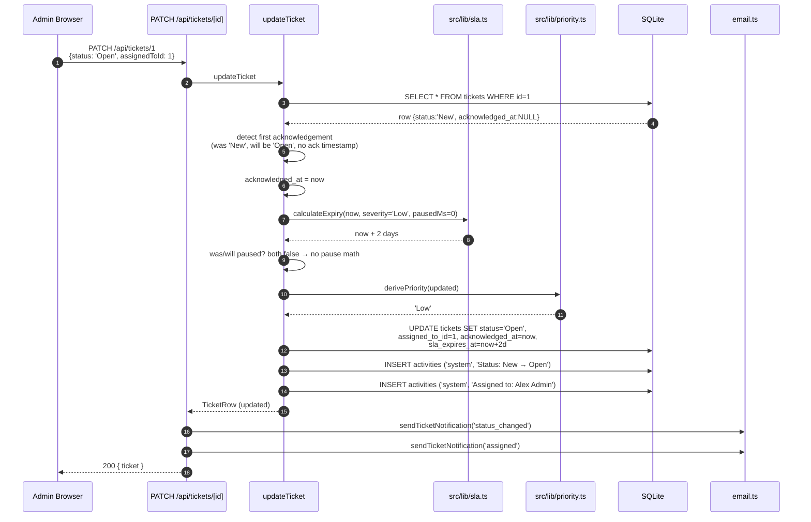
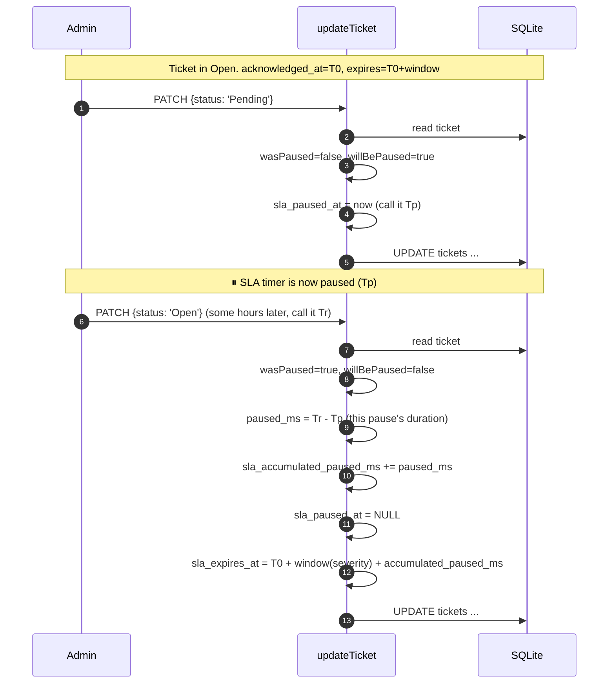
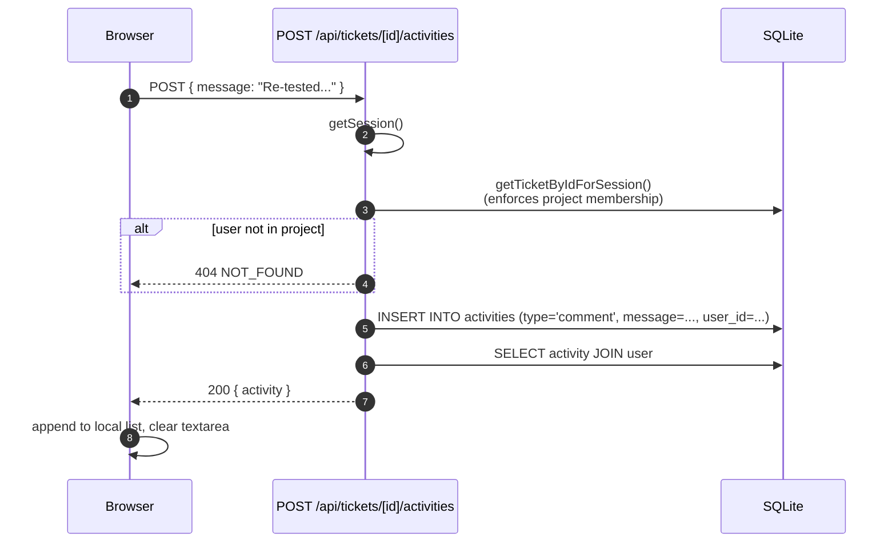
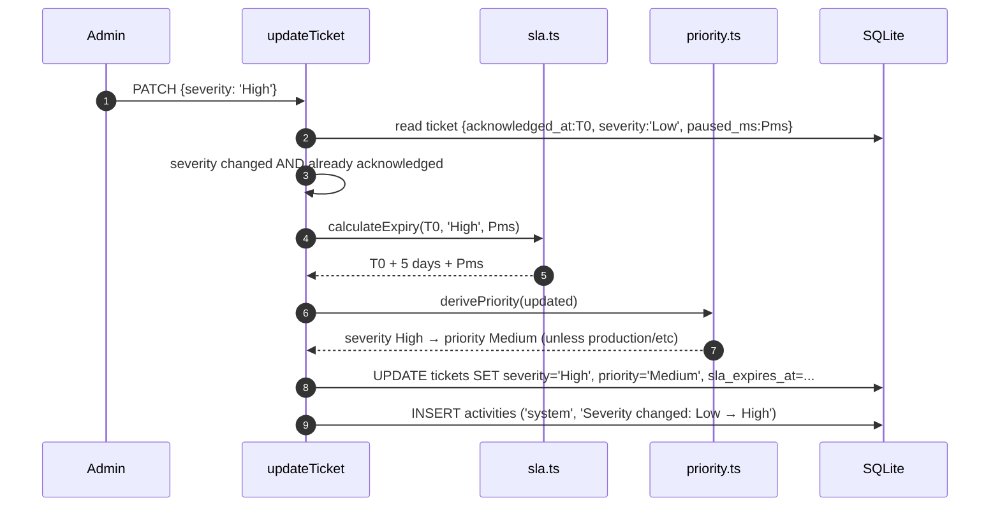
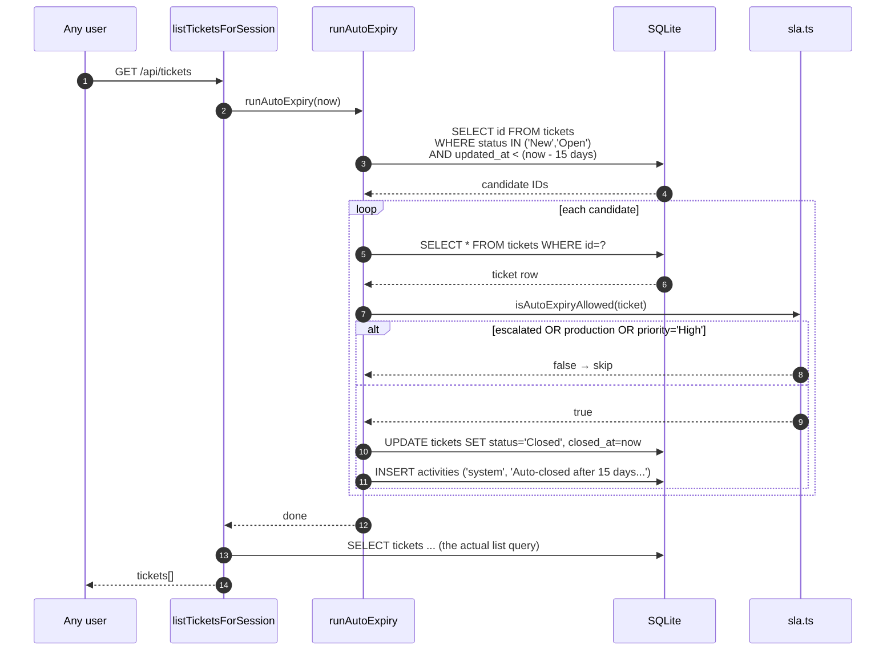
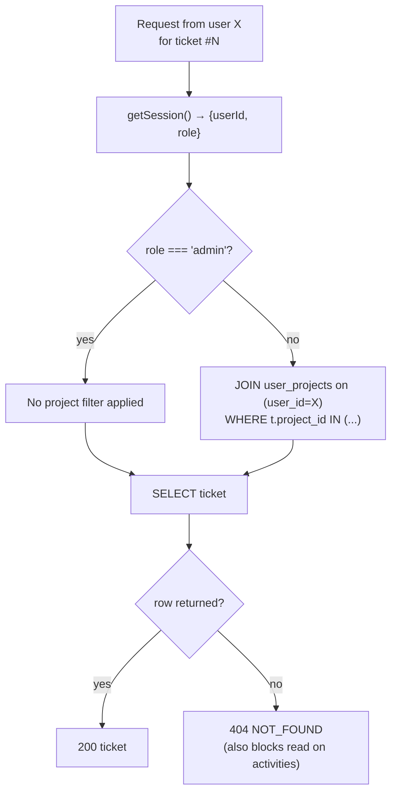
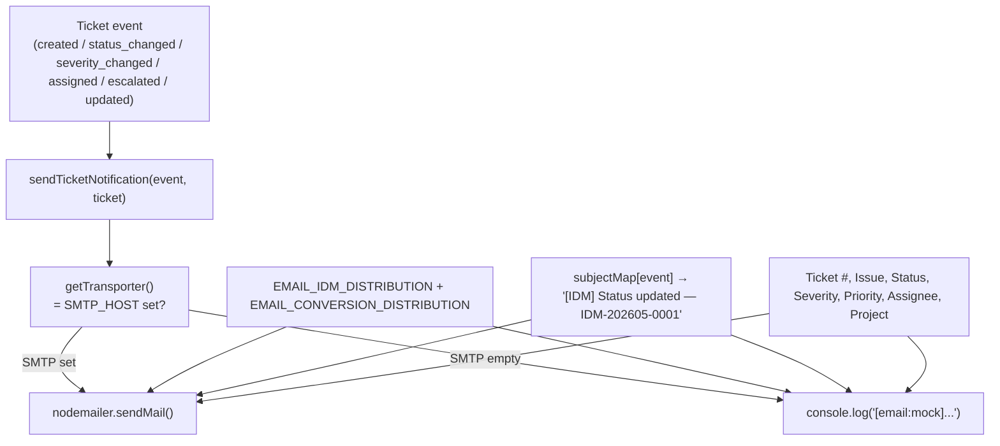
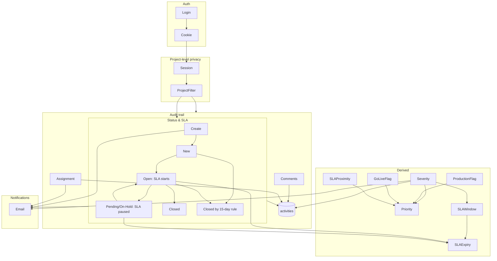

# End-to-end workflows

Each section below traces one full user journey — from the click in the browser through middleware, API, domain layer, and database — using sequence diagrams plus the exact files involved.

> Read [ARCHITECTURE.md](ARCHITECTURE.md) first if you want the layer model these flows are built on.

---

## Workflow 1 — Login & session establishment

**Triggered by:** clicking "Sign in" on `/`.



**Files touched:**
- [src/app/page.tsx](../src/app/page.tsx) — login screen with demo-account quick-fill
- [src/components/login-form.tsx](../src/components/login-form.tsx) — POSTs to the API
- [src/app/api/auth/login/route.ts](../src/app/api/auth/login/route.ts) — orchestrator
- [src/lib/auth.ts](../src/lib/auth.ts) — `authenticate`, `createSession`, `setSessionCookie`
- [src/lib/seed.ts](../src/lib/seed.ts) — runs on first-ever login if users table empty
- [src/middleware.ts](../src/middleware.ts) — gates every subsequent request

**Notable:**
- Database is **lazy-seeded** on the first login attempt — there's no separate seed step required.
- The cookie is **HttpOnly** (no JS access), **SameSite=Lax**, 12-hour expiry.
- Middleware uses the `jose` library, which is Edge-runtime compatible — meaning auth checks happen at the very edge before any Server Component renders.

---

## Workflow 2 — User creates a ticket

**Triggered by:** non-admin clicks "+ Create ticket" → fills form → "Save".



**Defaults applied at creation (per the requirements):**
- `status = 'New'`
- `severity = 'Low'`
- `assigned_to_id = NULL`
- `acknowledged_at = NULL` (SLA hasn't started)

**What an admin can override at creation time:** severity, status, assigned-to. The API route only adds those to the body if `session.role === 'admin'`. Even if a user crafts a request with these fields, the route silently drops them.

**Files touched:**
- [src/app/dashboard/tickets/new/page.tsx](../src/app/dashboard/tickets/new/page.tsx)
- [src/components/ticket-create-form.tsx](../src/components/ticket-create-form.tsx)
- [src/app/api/tickets/route.ts](../src/app/api/tickets/route.ts)
- [src/lib/tickets.ts](../src/lib/tickets.ts) → `createTicket`

---

## Workflow 3 — Admin acknowledges a New ticket (the moment SLA starts)

**Triggered by:** admin opens a `New` ticket and changes Status to `Open` (or assigns themselves).



**Why two activity entries:** the audit trail records each *kind* of change separately so a future hand-over reader can see "what happened, in which order, by whom".

**Why two emails:** two distinct events occurred (status changed AND assignment changed). The route loops the `events` array and fires one per event.

**SLA math at this point:**
```
acknowledged_at  = 2026-05-06T10:00:00Z
severity         = Low → window = 2 days = 172,800,000 ms
paused_ms        = 0
sla_expires_at   = 2026-05-06T10:00:00Z + 172,800,000 ms
                 = 2026-05-08T10:00:00Z
```

---

## Workflow 4 — SLA pause / resume (Pending or On-Hold)

**Triggered by:** admin sets status to `Pending` (waiting on requester) or `On-Hold` (waiting on third party), then later returns it to `Open`.



**Result:** the expiry is pushed forward by exactly the time the ticket sat in Pending/On-Hold. Multiple pause-resume cycles accumulate correctly because we store `sla_accumulated_paused_ms`, not just the latest pause.

---

## Workflow 5 — User adds a comment

**Triggered by:** any user (or admin) types in the Activities tab and clicks "Post".



**Why it's safe:** the comment endpoint goes through `getTicketByIdForSession`, which enforces project membership. A user can never post a comment on a ticket from a project they're not in — the lookup returns `null`, which becomes a 404.

---

## Workflow 6 — Admin changes severity (and the SLA recalc that follows)

**Triggered by:** admin edits severity on an already-acknowledged ticket.



**If the ticket is still `New` (not yet acknowledged):** severity is updated, but `sla_expires_at` stays NULL. The recalc only runs `if (acknowledged_at)`.

---

## Workflow 7 — Auto-close after 15 days inactivity

**Triggered by:** any user listing or reading tickets. The check piggybacks on every read so we don't need a cron job for the demo.



**For production:** move `runAutoExpiry` to a scheduled job (cron, Vercel Cron, GitHub Actions on a schedule) so it doesn't pay the cost on every list call. The current piggyback approach is fine for the demo.

---

## Workflow 8 — Project-level data privacy enforcement

This isn't really a workflow — it's a *rule* applied to every list/read. But it's worth showing because it's the single most important security property of the app.



**Important property:** when a user requests a ticket from a project they're not in, the response is **404, not 403**. This means a user cannot enumerate or distinguish "ticket exists but I can't see it" from "ticket doesn't exist". The data simply doesn't exist from their perspective.

This rule is enforced in [`getTicketByIdForSession`](../src/lib/tickets.ts) and [`listTicketsForSession`](../src/lib/tickets.ts).

---

## Workflow 9 — Email notification flow



**Files:** [src/lib/email.ts](../src/lib/email.ts).

**Console fallback:** lets the developer see exactly what *would* have been sent — useful for verifying your event-to-recipient mapping without an SMTP service.

---

## Cross-workflow connections (the "everything is connected" map)



This is the whole system. Every change to a ticket touches:
1. **Project privacy** — was the actor allowed?
2. **Lifecycle** — what status/SLA transition is implied?
3. **Derived state** — re-derive priority + recalc SLA expiry
4. **Audit trail** — append a system entry
5. **Notification** — fire one or more emails

If you ever add a new field, follow that same five-step ritual.

---

## Where to go next

- [DATA_MODEL.md](DATA_MODEL.md) — the schema each workflow touches
- [API.md](API.md) — the request/response shapes for each endpoint used above
- [ARCHITECTURE.md](ARCHITECTURE.md) — the layer model these flows live within
